# ZURU-Assignment

### **Commands:**
1. **`pyls`**: This lists out the top level (in the directory interpreter) directories and files, and it ignores the file which starts with '.'. Example:

    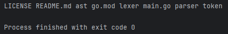
2. **`pyls -A`**: This prints all the files and directories (including files starting with '.'). Example:
    
    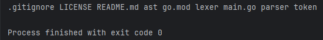
3. **`pyls -l`**: This prints details information of the files and directories like permission, file or directory size, date, name vertically. Example:

   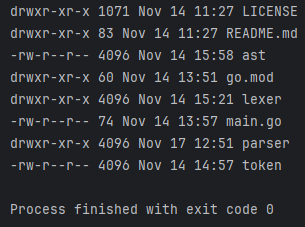
4. **`pyls -l -r`**: This reverses the order of the files and directory. Example:

   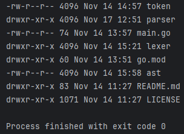
5. **`pyls -l -t`**: This sorted order of the files and directory based on time (oldest first). Example:

   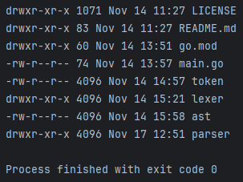
6. **`pyls -l --filter=<option>`**: This filtered out file or directories based on provided options(file, dir). `pyls -l --filter=file` filtered out only file, `pyls -l --filter=dir` filtered out only dir, but an error message will be displayed if neither _file_ nor _dir_ is specified. Example:
   
   |          Command          |                                         Images                                          |
   |:-------------------------:|:---------------------------------------------------------------------------------------:|
   |  `pyls -l --filter=dir`   |     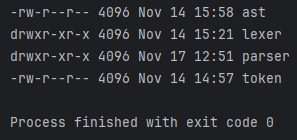      |
   |  `pyls -l --filter=file`  |    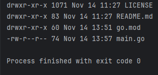    |
   | `pyls -l --filter=folder` | 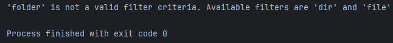 |
7. **`pyls -l <path>`**: This searched through the directories shows all the subdirectories, files. It can also handle relative paths, but if the path is unknown, then an error will be shown. Example:

   |           Command           |                                        Images                                         |
   |:---------------------------:|:-------------------------------------------------------------------------------------:|
   |      `pyls -l parser`       | 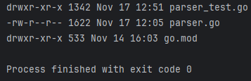 |
   | `pyls -l parser/parser.go`  |  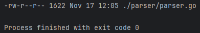   |
   | `pyls -l non_existent_path` | 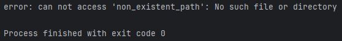 |
8. **`pyls -l -h`**: This converted size of the file or directory to human-readable size. Example:

   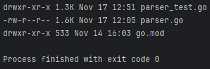